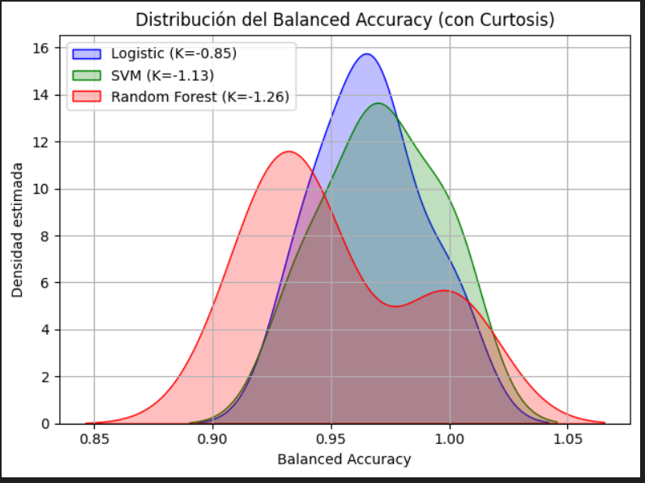

# 🧬 Breast Cancer Classification

Este proyecto aplica algoritmos de Machine Learning para predecir si una muestra de tejido mamario es **benigna** o **maligna**, utilizando el dataset de Breast Cancer Wisconsin. Se entrenaron y compararon tres modelos de clasificación supervisada con especial atención a la métrica **balanced accuracy**, adecuada en escenarios con posible desbalance de clases.

---

## 📂 Dataset

- **Fuente:** [UCI Machine Learning Repository](https://archive.ics.uci.edu/ml/datasets/breast+cancer+wisconsin+(original))

- **Variable objetivo:** Clasificación del tumor (2: benigno, 4: maligno)

---

## ⚙️ Modelos utilizados

- 🔵 Regresión Logística
- 🟢 Support Vector Machine (SVM) lineal
- 🔴 Random Forest

Cada modelo fue evaluado con **validación cruzada 10-fold** utilizando la métrica **balanced accuracy** para asegurar una evaluación equilibrada entre clases.

---

## 📊 Resultados

| Modelo              | Balanced Accuracy |
|---------------------|-------------------|
| Regresión Logística | 0.97              |
| SVM lineal          | 0.97              |
| Random Forest       | 0.95              |

> 🔎 Regresión Logística y SVM lineal obtuvieron el mejor desempeño. Esta coincidencia se debe a que ambos son clasificadores lineales y el dataset presenta una clara separación entre clases. Random Forest no superó a los modelos lineales, posiblemente por una leve sobreajuste o por la ausencia de relaciones no lineales fuertes.

---

## 📈 Distribución del Balanced Accuracy

Se graficó la distribución del balanced accuracy usando estimación de densidad (KDE), junto con la curtosis para evaluar estabilidad.

Todos los modelos presentan **curtosis negativa** (platicúrtica), lo que indica una dispersión ligeramente mayor en sus rendimientos, pero sin extremos. Esto sugiere que el desempeño es **estable y confiable**.



---

## 📌 Conclusiones

- Todos los modelos lograron un balanced accuracy superior al 95%, lo que indica alta capacidad predictiva.
- Modelos simples como la **Regresión Logística** y el **SVM lineal** fueron tan eficaces como el Random Forest, lo que refuerza su valor en contextos clínicos donde la interpretabilidad es importante.
- El análisis de la curtosis revela que el rendimiento es estable, sin valores extremos que comprometan la confiabilidad.

---

## ✅ Recomendaciones

- Priorizar **modelos interpretables** como Regresión Logística si se busca transparencia clínica.
- Evaluar también otras métricas: **precisión, recall, F1-score, curva ROC-AUC**.
- Visualizar la **matriz de confusión** para detectar errores relevantes.
- Realizar **ajuste de hiperparámetros con cuidado**, ya que el rendimiento ya es estable.
- Documentar versiones de los datos y modelos para asegurar **reproducibilidad**.

---

## 🚀 Cómo usar este repositorio

1. Clona el repositorio:
   ```bash
   git clone https://github.com/tu-usuario/breast-cancer-classification.git
   cd breast-cancer-classification

